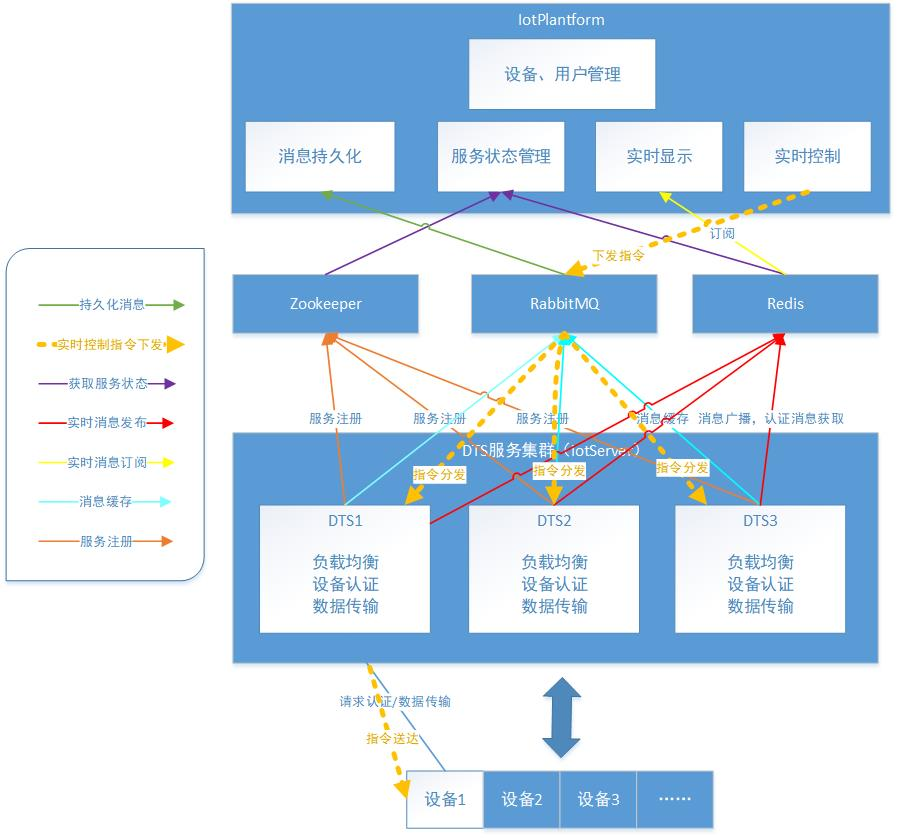
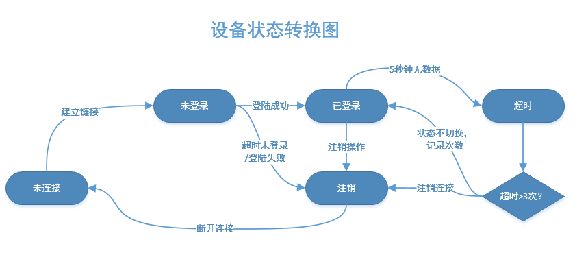
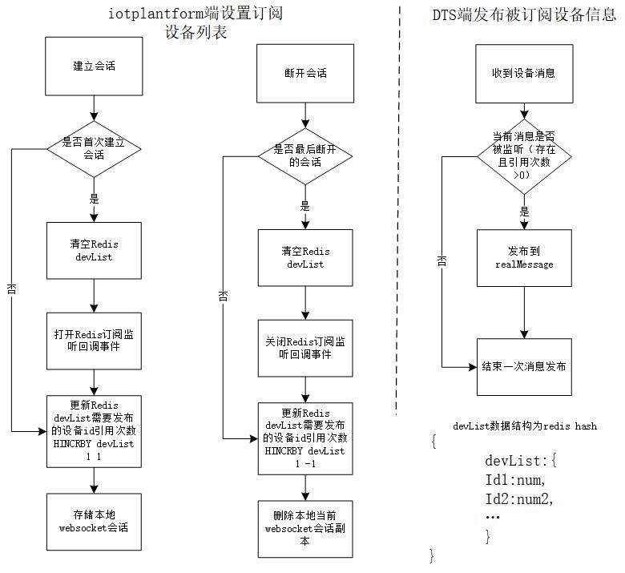

# 项目
iot server base on redis, netty, Zookeeper and rabbitmq
## 项目名称：
物联网设备数据传输与控制平台
##### 项目开始时间：2018-12-01
##### 项目结束时间：2019-07-01
## 开发轨迹

数据传输层（SDTS）:[https://github.com/dyingstraw/iotServer](https://github.com/dyingstraw/iotServer)

应用管理层（iotPlantform）:[https://github.com/dyingstraw/iotPlantform](https://github.com/dyingstraw/iotPlantform)

## 项目职责：
后台开发
## 项目简述：
该项目是一个物联网数据传输与控制平台，主要提供数据传输服务（DTS）集群、设备注册认证与数据传输、设备消息持久化与展示、用户实时控制设备等功能。
### 个人工作：
1. 基于Netty实现DTS，提供数据传输、设备认证、心跳包机制、反向控制等功能；
2. 基于Zookeeper实现DTS的集群注册，同时实现DTS负载均衡；
3. 基于Redis实现设备认证信息缓存、设备消息实时广播；
4. 基于RabbitMQ实现设备消息缓存入库，并实现用户反向控制指令下发排队；
5. 基于SpringBoot实现应用管理平台，应用层设备管理、用户管理、设备控制与展示等功能。

## 系统架构

## 设备认证流程

## 设备状态转换图

## 实时显示流程图

## 单机单节点压力测试效果
### 节点配置
名称|属性|备注
---|---|---
服务器os|win10 amd64|idea运行
虚拟机|Java HotSpot(TM) 64-Bit Server VM版本 25.121-b13||
JIT|HotSpot 64-Bit Tiered Compilers|
总编译时间|15.654 秒|
总物理内存|12,453,172 KB|
内网带宽|150M|实际没那么大
服务器网卡|Qualcomm Atheros QCA9377 Wireless Network Adapter

[点击查看平台压力测试详情(加载可能很慢)](https://htmlpreview.github.io/?https://raw.githubusercontent.com/dyingstraw/iotServer/master/img/mytest/index.html)

