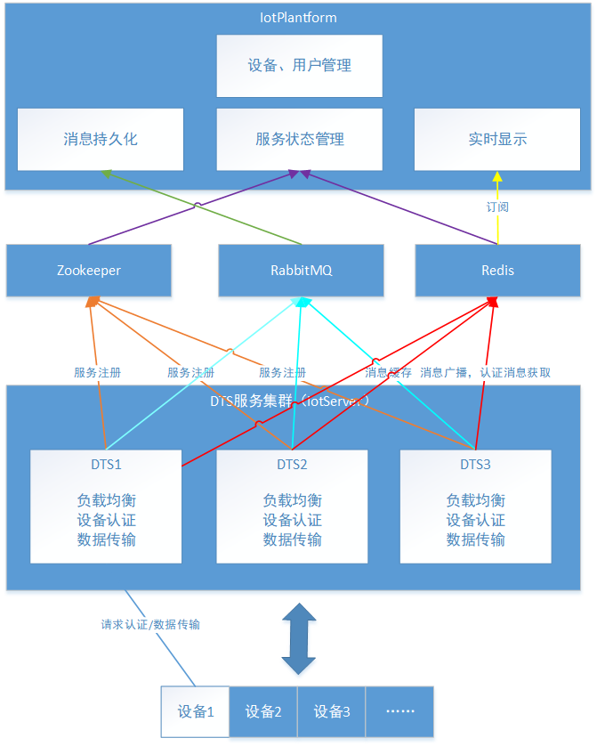
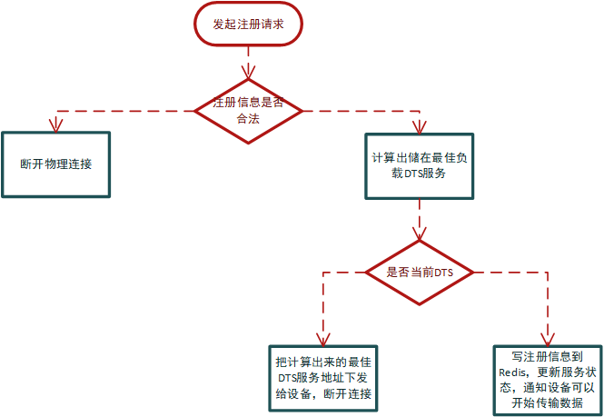
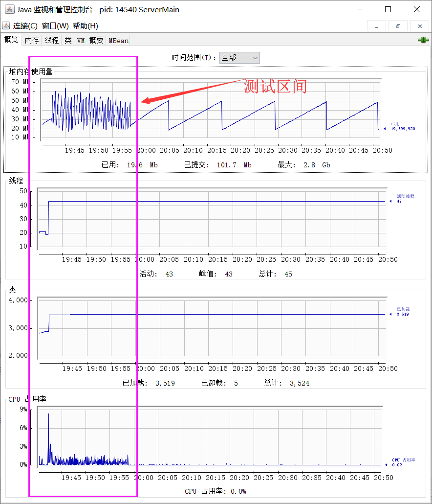

# iotServer
iot server base on redis, netty, Zookeeper and rabbitmq

# 项目名称：
分布式物联网设备数据传输与控制平台
# 项目开始时间：
2018-12-01
# 项目结束时间：
2019-07-01

# 项目职责：
后台开发
# 项目简述：
该项目是一个物联网设备数据采集平台，主要用到的技术有Netty NIO网络通讯框架，Redis发布订阅模型，消息队列RabbitMQ，SpringBoot后端框架，ZooKepper集群管理，数据库持久化主要使用了Mysql、以及用于持久化的MyBatis、Mybatis Plus持久化框架。 
## 个人工作：
 - 1、设计数据传输层（DTS）、通讯协议、ZooKeeper DTS集群管理、设备认证、DTS负载均衡，Redis全局认证信息缓存，心跳包策略； 
 - 2、RabbitMQ设备上传记录缓存，并在应用程（iotPlantform）持久化到MySQl数据库； 
 - 3、Redis发布订阅模型实时显示设备上传数据，并实现在应用层对设备反向控制； 
 - 4、应用层设备注册管理、用户注册登录管理、设备历史记录的分析与展示后台开发。
# 系统架构

# 开发轨迹
[开发轨迹](https://github.com/dyingstraw/iotServer/commits/master)
# 设备认证流程

# 单机单节点压力测试效果
### 节点配置
名称|属性|备注
---|---|---
服务器os|win10 amd64|idea运行
虚拟机|Java HotSpot(TM) 64-Bit Server VM版本 25.121-b13||
JIT|HotSpot 64-Bit Tiered Compilers|
总编译时间|15.654 秒|
总物理内存|12,453,172 KB|
内网带宽|150M|实际没那么大
服务器网卡|Qualcomm Atheros QCA9377 Wireless Network Adapter

[点击查看平台压力测试详情(加载可能很慢)](https://htmlpreview.github.io/?https://raw.githubusercontent.com/dyingstraw/iotServer/master/img/mytest/index.html)

